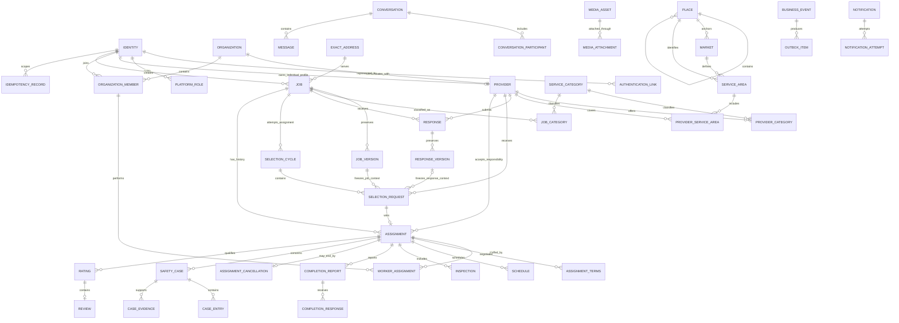
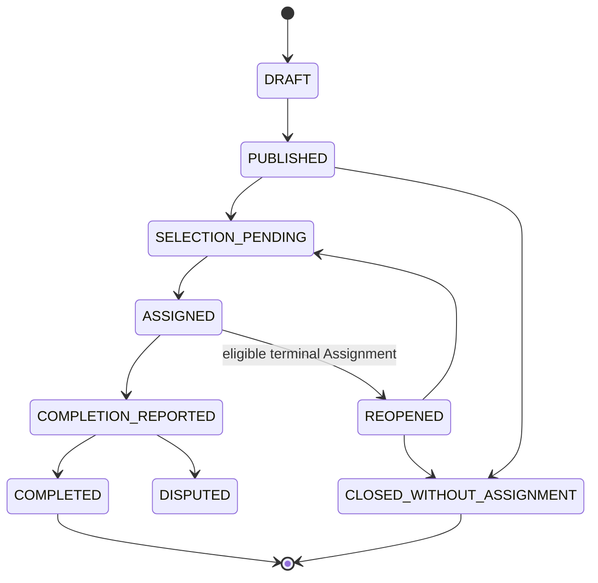
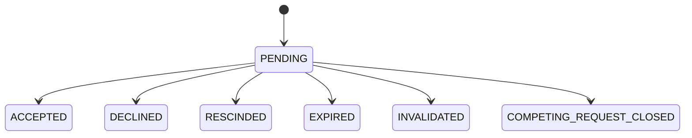
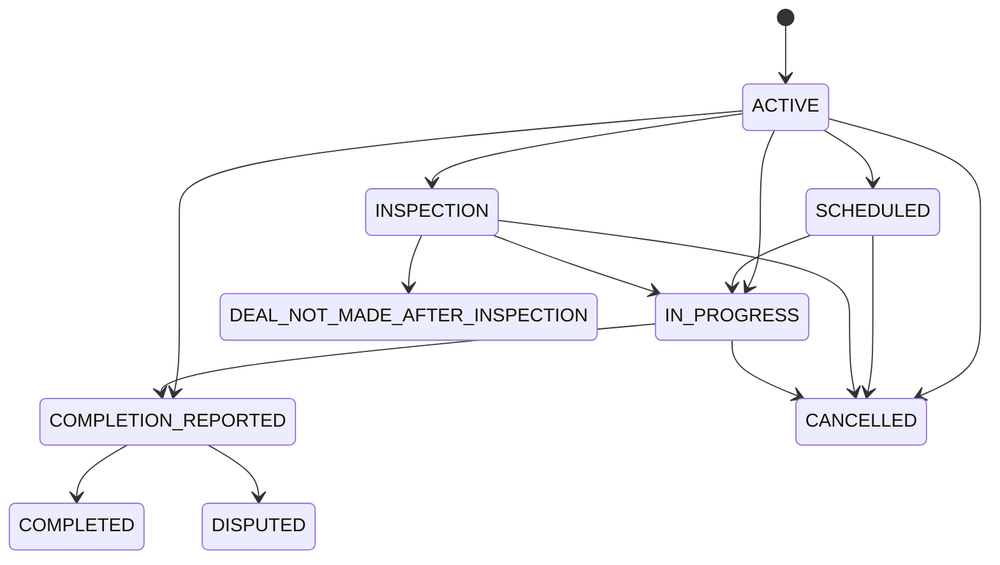

# Local Services Marketplace Database Design V1

**Document type:** Normative database design specification  
**Status:** Draft for founder review  
**Database target:** PostgreSQL 16  
**Implementation stage:** Design only  
**SQL status:** Not generated  
**Primary objective:** Define what the V1 database must contain, own, preserve, and enforce

---

## 1. Purpose

This document is the source of truth for the intended V1 database of the Local Verified Services Marketplace.

It defines:

- Authoritative database tables
- Ownership of business facts
- Table relationships and cardinalities
- Required columns and conceptual PostgreSQL types
- Current-state and historical-data strategy
- Primary keys, foreign keys, uniqueness, and validation rules
- Critical transaction boundaries
- Privacy and disclosure boundaries
- Idempotency and asynchronous-work persistence
- Search-engine independence
- Schema-evolution rules
- Features deliberately excluded from the V1 database

The later PostgreSQL migration must conform to this document. If the SQL and this document disagree, the disagreement must be reviewed explicitly rather than silently accepted.

---

## 2. Authority and scope

Authority order:

1. Gold SRS v0.2
2. Approved Domain Model v0.1
3. Founder-approved policy amendments
4. V1 Product and Policy Baseline v0.1
5. Logical Data Model v0.1
6. Corrected Architecture and Data Design v0.1
7. Confirmed findings from technical validation

This design covers the operational V1 database. It does not define frontend forms, API payloads, cloud-provider configuration, ORM models, or production SQL migrations.

---

## 3. Founder policy amendment

### 3.1 Worker Identity

This decision supersedes the earlier V1 policy that allowed an Organization-managed Worker to exist without a linked Identity.

> Every Worker must have an internal platform Identity and at least one verified email-level Authentication Link before being assigned to marketplace Work.

An Organization may invite a Worker, but an identity-less Worker record is not permitted in this database design.

---

## 4. Core design principles

1. **One authoritative owner per fact.** No independently mutable copies of the same business fact.
2. **A domain concept does not automatically require a table.** A table exists only for an independent lifecycle, many-to-many relationship, historical sequence, privacy boundary, independently referenced record, or enforceable constraint.
3. **PostgreSQL is authoritative.** Search systems and external services contain replaceable projections or provider-specific references only.
4. **Binary media stays outside PostgreSQL.** PostgreSQL stores metadata, ownership, validation state, and attachment relationships.
5. **Material history is preserved.** Material Job, Response, terms, schedule, Completion, cancellation, safety, and Rating facts are never silently overwritten.
6. **Stable relationships use foreign keys.** Generic polymorphic references are avoided when proper foreign keys are practical.
7. **Database constraints are integrity backstops.** Multi-record business workflows still require coordinated application transactions.
8. **V1 avoids speculative infrastructure.** No payment, escrow, AI classification, warehouse, Kafka, or vendor-specific search schema.

---

## 5. PostgreSQL conventions

- Major identifiers: `uuid`
- Operational timestamps: `timestamptz`, stored in UTC
- Local schedule context: IANA time-zone identifier in `text`
- Currency: ISO-style three-character code in `char(3)`
- Money: signed `bigint` minor units, with non-negative checks where appropriate
- Flexible event payloads: `jsonb`, used only for non-authoritative extension data
- Status values: constrained `text` for V1, not PostgreSQL enums
- Table names: singular `snake_case`
- Ordinary business deletion: status transition or timestamp, not physical deletion

All tables should normally include `created_at`. Mutable current-state tables should also include `updated_at`.

---

## 6. High-level entity relationship diagram

---

## 7. Authoritative table inventory

### Identity and authorization

1. `identity`
2. `authentication_link`
3. `platform_role`

### Providers and organizations

4. `organization`
5. `provider`
6. `organization_member`
7. `provider_category`
8. `provider_service_area`

### Geography and taxonomy

9. `place`
10. `market`
11. `service_area`
12. `service_category`
13. `waitlist_interest`

### Marketplace

14. `exact_address`
15. `job`
16. `job_version`
17. `job_category`
18. `response`
19. `response_version`
20. `selection_cycle`
21. `selection_request`
22. `assignment`

### Fulfilment

23. `worker_assignment`
24. `assignment_terms`
25. `schedule`
26. `inspection`
27. `completion_report`
28. `completion_response`
29. `assignment_cancellation`

### Trust, safety, and reputation

30. `safety_case`
31. `case_entry`
32. `case_evidence`
33. `restriction`
34. `rating`
35. `review`

### Communication and media

36. `conversation`
37. `conversation_participant`
38. `message`
39. `media_asset`
40. `media_attachment`
41. `disclosure_record`

### Operations

42. `idempotency_record`
43. `business_event`
44. `outbox_item`
45. `notification`
46. `notification_attempt`
47. `privileged_audit_event`

---

## 8. Table specifications

### 8.1 `identity`

**Purpose:** One internal human account. Customer participation is derived from owned Jobs and does not require a separate Customer table.

| Column | Type | Null | Rule |
|---|---|---:|---|
| identity_id | uuid | No | Primary key |
| display_name | text | No | Non-empty |
| preferred_locale | text | No | Locale identifier |
| status | text | No | ACTIVE, DISABLED, CLOSED |
| created_at | timestamptz | No | Creation time |
| updated_at | timestamptz | No | Current-state update |
| disabled_at | timestamptz | Yes | Required when disabled |
| closed_at | timestamptz | Yes | Required when closed |

**Relationships:** Referenced by authentication, roles, individual Provider ownership, Organization membership, Jobs, messages, actions, and audit records.

---

### 8.2 `authentication_link`

**Purpose:** Map an internal Identity to a managed authentication provider.

| Column | Type | Null | Rule |
|---|---|---:|---|
| authentication_link_id | uuid | No | Primary key |
| identity_id | uuid | No | FK to identity |
| provider_type | text | No | Authentication provider category |
| provider_subject | text | No | Stable provider subject |
| email | text | Yes | Normalized email when supplied |
| email_verified_at | timestamptz | Yes | Verified email time |
| status | text | No | ACTIVE, UNLINKED, REVOKED |
| linked_at | timestamptz | No | Link time |
| unlinked_at | timestamptz | Yes | Unlink time |

**Unique:** `(provider_type, provider_subject)`.

**Worker rule:** An Identity used as an assigned Worker must have at least one active Authentication Link with a verified email.

---

### 8.3 `platform_role`

**Purpose:** Platform-wide privileged authority. Organization authority is stored in `organization_member`.

| Column | Type | Null | Rule |
|---|---|---:|---|
| platform_role_id | uuid | No | Primary key |
| identity_id | uuid | No | FK to identity |
| role | text | No | PLATFORM_ADMIN, TRUST_AND_SAFETY, SUPPORT |
| status | text | No | ACTIVE, REVOKED |
| granted_at | timestamptz | No | Grant time |
| granted_by_identity_id | uuid | Yes | FK to identity |
| revoked_at | timestamptz | Yes | Revocation time |

**Unique active rule:** One active grant per Identity and role.

---

### 8.4 `organization`

**Purpose:** A shop, agency, company, or another organizational Provider.

| Column | Type | Null | Rule |
|---|---|---:|---|
| organization_id | uuid | No | Primary key |
| organization_type | text | No | SHOP, AGENCY, COMPANY, OTHER |
| display_name | text | No | Public name |
| legal_name | text | Yes | Private legal name |
| description | text | Yes | Public profile description |
| status | text | No | DRAFT, ACTIVE, SUSPENDED, CLOSED |
| verification_status | text | No | UNVERIFIED, PENDING, VERIFIED, REJECTED |
| created_at | timestamptz | No | Creation time |
| updated_at | timestamptz | No | Update time |

**Rule:** An Organization does not authenticate directly. Authenticated members act for it.

---

### 8.5 `provider`

**Purpose:** Common responsible marketplace party for an individual or Organization.

| Column | Type | Null | Rule |
|---|---|---:|---|
| provider_id | uuid | No | Primary key |
| provider_kind | text | No | INDIVIDUAL or ORGANIZATION |
| individual_identity_id | uuid | Yes | FK to identity |
| organization_id | uuid | Yes | FK to organization |
| display_name | text | No | Marketplace name |
| description | text | Yes | Public description |
| status | text | No | DRAFT, ACTIVE, SUSPENDED, CLOSED |
| visibility | text | No | PUBLIC, HIDDEN |
| verification_status | text | No | Summary state |
| created_at | timestamptz | No | Creation time |
| updated_at | timestamptz | No | Update time |

**Checks:** Exactly one of `individual_identity_id` and `organization_id` is present, consistent with `provider_kind`.

**Unique active rules:** At most one active individual Provider per Identity and one active organizational Provider per Organization.

---

### 8.6 `organization_member`

**Purpose:** Authenticated Organization membership and Worker eligibility.

| Column | Type | Null | Rule |
|---|---|---:|---|
| organization_member_id | uuid | No | Primary key |
| organization_id | uuid | No | FK to organization |
| identity_id | uuid | No | FK to identity |
| member_role | text | No | ADMINISTRATOR, WORKER, ADMINISTRATOR_AND_WORKER |
| membership_status | text | No | INVITED, ACTIVE, SUSPENDED, ENDED |
| can_perform_work | boolean | No | Assignment eligibility |
| joined_at | timestamptz | Yes | Active membership start |
| ended_at | timestamptz | Yes | Membership end |
| created_at | timestamptz | No | Record creation |

**Unique active rule:** One active membership per Organization and Identity.

---

### 8.7 `provider_category`

**Purpose:** Many-to-many Provider-to-Category relationship.

| Column | Type | Null | Rule |
|---|---|---:|---|
| provider_id | uuid | No | FK to provider; composite PK |
| category_id | uuid | No | FK to service_category; composite PK |
| status | text | No | ACTIVE, REMOVED |
| added_at | timestamptz | No | Addition time |
| removed_at | timestamptz | Yes | Removal time |

---

### 8.8 `provider_service_area`

**Purpose:** Declare where a Provider operates.

| Column | Type | Null | Rule |
|---|---|---:|---|
| provider_service_area_id | uuid | No | Primary key |
| provider_id | uuid | No | FK to provider |
| service_area_id | uuid | No | FK to service_area |
| status | text | No | ACTIVE, REMOVED |
| created_at | timestamptz | No | Addition time |
| removed_at | timestamptz | Yes | Removal time |

**Unique active rule:** One active relationship per Provider and Service Area.

---

### 8.9 `place`

**Purpose:** Globally adaptable geographic hierarchy.

| Column | Type | Null | Rule |
|---|---|---:|---|
| place_id | uuid | No | Primary key |
| parent_place_id | uuid | Yes | Self-referencing FK |
| country_code | char(2) | No | Country context |
| place_type | text | No | COUNTRY, REGION, CITY, DISTRICT, LOCALITY |
| canonical_name | text | No | Stable display name |
| local_name | text | Yes | Localized name |
| timezone_id | text | Yes | IANA zone |
| status | text | No | ACTIVE, RETIRED |

---

### 8.10 `market`

**Purpose:** Operational activation boundary separate from Place existence.

| Column | Type | Null | Rule |
|---|---|---:|---|
| market_id | uuid | No | Primary key |
| primary_place_id | uuid | No | FK to place |
| name | text | No | Market name |
| status | text | No | INACTIVE, ACTIVE, PAUSED, CLOSED |
| activated_at | timestamptz | Yes | Activation time |
| deactivated_at | timestamptz | Yes | Deactivation time |
| created_at | timestamptz | No | Creation time |

**V1 decision:** One primary Place per Market. A many-place Market bridge is deferred until needed.

---

### 8.11 `service_area`

**Purpose:** Matching area within a Market, separate from exact address.

| Column | Type | Null | Rule |
|---|---|---:|---|
| service_area_id | uuid | No | Primary key |
| market_id | uuid | No | FK to market |
| place_id | uuid | No | FK to place |
| label | text | No | Display label |
| status | text | No | ACTIVE, INACTIVE, RETIRED |
| created_at | timestamptz | No | Creation time |

---

### 8.12 `service_category`

**Purpose:** Platform-governed service taxonomy.

| Column | Type | Null | Rule |
|---|---|---:|---|
| category_id | uuid | No | Primary key |
| parent_category_id | uuid | Yes | Self-referencing FK |
| code | text | No | Stable unique code |
| name | text | No | Display name |
| description | text | Yes | Explanation |
| status | text | No | ACTIVE, INACTIVE, RETIRED |
| sort_order | integer | No | Non-negative |
| created_at | timestamptz | No | Creation time |
| retired_at | timestamptz | Yes | Retirement time |

**Rule:** `OTHER` is governed data, not user-created taxonomy.

---

### 8.13 `waitlist_interest`

**Purpose:** Consent-based interest where no active Market supports a live Job.

| Column | Type | Null | Rule |
|---|---|---:|---|
| waitlist_interest_id | uuid | No | Primary key |
| identity_id | uuid | Yes | Optional FK to identity |
| place_id | uuid | No | FK to place |
| category_id | uuid | Yes | Optional FK to service_category |
| contact_email | text | No | Contact channel |
| consent_status | text | No | GRANTED, WITHDRAWN |
| created_at | timestamptz | No | Creation time |

**Rule:** A Waitlist Interest is never a Job.

---

### 8.14 `exact_address`

**Purpose:** Store sensitive addresses outside discovery-level Job information.

| Column | Type | Null | Rule |
|---|---|---:|---|
| exact_address_id | uuid | No | Primary key |
| owner_identity_id | uuid | No | FK to identity |
| country_code | char(2) | No | Country |
| administrative_area | text | Yes | Province/state/region |
| city | text | Yes | City |
| locality | text | Yes | Locality |
| street_address | text | No | Exact street details |
| postal_code | text | Yes | Postal code |
| latitude | numeric | Yes | Exact coordinate |
| longitude | numeric | Yes | Exact coordinate |
| status | text | No | ACTIVE, RETIRED |
| created_at | timestamptz | No | Creation time |

**Privacy rule:** Presence of an address on a Job never authorizes disclosure.

---

### 8.15 `job`

**Purpose:** Authoritative Job identity and current lifecycle state.

| Column | Type | Null | Rule |
|---|---|---:|---|
| job_id | uuid | No | Primary key |
| customer_identity_id | uuid | No | FK to identity |
| market_id | uuid | No | FK to market |
| service_area_id | uuid | No | FK to service_area |
| current_version_id | uuid | Yes | FK to job_version; set after first version |
| exact_address_id | uuid | Yes | FK to exact_address |
| origin_provider_id | uuid | Yes | Profile-originated Job source |
| status | text | No | Current Job state |
| visibility | text | No | Discovery visibility |
| published_at | timestamptz | Yes | Publication time |
| expires_at | timestamptz | Yes | Current publication expiry |
| completed_at | timestamptz | Yes | Recorded Completion |
| closure_reason | text | Yes | Unassigned or administrative closure reason |
| closed_by_identity_id | uuid | Yes | FK to identity |
| closed_at | timestamptz | Yes | Closure time |
| created_at | timestamptz | No | Creation time |
| updated_at | timestamptz | No | Current-state update |

**Initial statuses:** `DRAFT`, `PUBLISHED`, `SELECTION_PENDING`, `ASSIGNED`, `REOPENED`, `COMPLETION_REPORTED`, `COMPLETED`, `CLOSED_WITHOUT_ASSIGNMENT`, `DISPUTED`.

**Rules:** Completed Jobs never reopen. Live publication requires an active Market. `service_area.market_id` must match `job.market_id`.

---

### 8.16 `job_version`

**Purpose:** Immutable material Job context.

| Column | Type | Null | Rule |
|---|---|---:|---|
| job_version_id | uuid | No | Primary key |
| job_id | uuid | No | FK to job |
| version_number | integer | No | Positive sequence |
| description | text | No | Customer problem/request |
| urgency | text | No | NORMAL, ASAP, EMERGENCY, SCHEDULED |
| pricing_intent | text | No | NONE, FIXED, BUDGET, RANGE, INSPECTION_FIRST |
| currency_code | char(3) | Yes | Required when money supplied |
| budget_min_minor | bigint | Yes | Non-negative |
| budget_max_minor | bigint | Yes | Non-negative and not below min |
| inspection_intent | text | No | NONE, ALLOWED, REQUESTED |
| schedule_intent | text | No | FLEXIBLE, ASAP, WINDOW, FIXED |
| approximate_place_id | uuid | Yes | FK to place |
| change_class | text | No | INITIAL, MINOR, MATERIAL |
| created_by_identity_id | uuid | No | FK to identity |
| created_at | timestamptz | No | Creation time |

**Unique:** `(job_id, version_number)`.

**Mutability:** A version referenced by a Selection Request is immutable. Material edits create a new version and invalidate affected Requests.

---

### 8.17 `job_category`

**Purpose:** Many-to-many Job-to-Category relationship.

| Column | Type | Null | Rule |
|---|---|---:|---|
| job_id | uuid | No | FK to job; composite PK |
| category_id | uuid | No | FK to service_category; composite PK |
| source | text | No | CUSTOMER, SYSTEM_OTHER, ADMIN |
| added_at | timestamptz | No | Addition time |

---

### 8.18 `response`

**Purpose:** Provider participation in a Job, with one active Response per Provider and Job.

| Column | Type | Null | Rule |
|---|---|---:|---|
| response_id | uuid | No | Primary key |
| job_id | uuid | No | FK to job |
| provider_id | uuid | No | FK to provider |
| current_version_id | uuid | Yes | FK to response_version |
| status | text | No | ACTIVE, WITHDRAWN, SUPERSEDED, CLOSED |
| submitted_at | timestamptz | No | Initial submission |
| withdrawn_at | timestamptz | Yes | Withdrawal time |
| created_at | timestamptz | No | Creation time |

**Unique active rule:** One active Response per Provider and Job.

---

### 8.19 `response_version`

**Purpose:** Immutable material Response proposal history.

| Column | Type | Null | Rule |
|---|---|---:|---|
| response_version_id | uuid | No | Primary key |
| response_id | uuid | No | FK to response |
| version_number | integer | No | Positive sequence |
| message | text | Yes | Provider message |
| price_kind | text | Yes | FIXED, ESTIMATE, RANGE, INSPECTION_FIRST |
| currency_code | char(3) | Yes | Required with price |
| amount_minor | bigint | Yes | Non-negative |
| range_min_minor | bigint | Yes | Non-negative |
| range_max_minor | bigint | Yes | Not below min |
| inspection_requested | boolean | No | Default false |
| availability_note | text | Yes | Availability details |
| proposed_start_at | timestamptz | Yes | Optional proposal |
| proposed_end_at | timestamptz | Yes | Optional proposal |
| timezone_id | text | Yes | IANA time zone |
| created_at | timestamptz | No | Creation time |

**Unique:** `(response_id, version_number)`.

---

### 8.20 `selection_cycle`

**Purpose:** Validity boundary for one assignment attempt after publication or reopening.

| Column | Type | Null | Rule |
|---|---|---:|---|
| selection_cycle_id | uuid | No | Primary key |
| job_id | uuid | No | FK to job |
| cycle_number | integer | No | Positive sequence |
| status | text | No | OPEN, WON, CLOSED, INVALIDATED |
| opened_at | timestamptz | No | Open time |
| closed_at | timestamptz | Yes | Close time |
| close_reason | text | Yes | Terminal reason |

**Unique:** `(job_id, cycle_number)`.

**Unique active rule:** One open Selection Cycle per Job.

---

### 8.21 `selection_request`

**Purpose:** Customer invitation asking one Provider to accept responsibility.

| Column | Type | Null | Rule |
|---|---|---:|---|
| selection_request_id | uuid | No | Primary key |
| selection_cycle_id | uuid | No | FK to selection_cycle |
| provider_id | uuid | No | FK to provider |
| job_version_id | uuid | No | Immutable Job context |
| response_version_id | uuid | Yes | Optional immutable Response context |
| status | text | No | PENDING, ACCEPTED, DECLINED, RESCINDED, EXPIRED, INVALIDATED, COMPETING_REQUEST_CLOSED |
| issued_by_identity_id | uuid | No | FK to identity |
| issued_at | timestamptz | No | Issue time |
| expires_at | timestamptz | No | Policy-calculated expiry |
| terminal_at | timestamptz | Yes | Terminal time |
| terminal_reason | text | Yes | Terminal explanation |

**Rules:** The Job Version must belong to the Selection Cycle's Job. A Response Version, if present, must belong to the same Provider and Job. Terminal Requests never reactivate.

---

### 8.22 `assignment`

**Purpose:** Authoritative accepted Provider responsibility for a Job.

| Column | Type | Null | Rule |
|---|---|---:|---|
| assignment_id | uuid | No | Primary key |
| job_id | uuid | No | FK to job |
| selection_cycle_id | uuid | No | FK to selection_cycle |
| winning_selection_request_id | uuid | No | Unique FK to selection_request |
| provider_id | uuid | No | FK to provider |
| accepted_by_identity_id | uuid | No | Authenticated accepting actor |
| status | text | No | Current Assignment state |
| formed_at | timestamptz | No | Formation time |
| terminal_reason | text | Yes | Terminal outcome/reason |
| terminal_at | timestamptz | Yes | Terminal time |
| created_at | timestamptz | No | Creation time |

**Initial statuses:** `ACTIVE`, `SCHEDULED`, `INSPECTION`, `IN_PROGRESS`, `COMPLETION_REPORTED`, `COMPLETED`, `CANCELLED`, `DEAL_NOT_MADE_AFTER_INSPECTION`, `DISPUTED`.

**Unique active rule:** At most one active Assignment per Job.

**Consistency:** Winning Request, cycle, Job, and Provider must agree. Organization is derived through Provider and is not duplicated.

---

### 8.23 `worker_assignment`

**Purpose:** Preserve current and replaced Workers for an organizational Assignment.

| Column | Type | Null | Rule |
|---|---|---:|---|
| worker_assignment_id | uuid | No | Primary key |
| assignment_id | uuid | No | FK to assignment |
| organization_member_id | uuid | No | FK to organization_member |
| assigned_at | timestamptz | No | Assignment time |
| disclosed_at | timestamptz | Yes | Customer disclosure time |
| ended_at | timestamptz | Yes | Replacement/end time |
| change_reason | text | Yes | Reason for replacement |

**Unique current rule:** One Worker Assignment with no `ended_at` per Assignment.

**Eligibility:** Member must be active, belong to the responsible Organization, be able to perform work, and satisfy the verified-email Identity rule.

---

### 8.24 `assignment_terms`

**Purpose:** Append-only negotiation and accepted scope/price history.

| Column | Type | Null | Rule |
|---|---|---:|---|
| assignment_terms_id | uuid | No | Primary key |
| assignment_id | uuid | No | FK to assignment |
| revision_number | integer | No | Positive sequence |
| scope_description | text | Yes | Proposed/agreed scope |
| price_kind | text | Yes | NONE, FIXED, ESTIMATE, RANGE, INSPECTION_FIRST |
| currency_code | char(3) | Yes | Required with monetary terms |
| amount_minor | bigint | Yes | Non-negative |
| range_min_minor | bigint | Yes | Non-negative |
| range_max_minor | bigint | Yes | Not below min |
| inspection_mode | text | Yes | DELIVERABLE or PRELIMINARY |
| proposed_by_identity_id | uuid | No | FK to identity |
| customer_accepted_at | timestamptz | Yes | Customer acceptance |
| provider_accepted_at | timestamptz | Yes | Provider acceptance |
| status | text | No | PROPOSED, ACCEPTED, REJECTED, SUPERSEDED |
| created_at | timestamptz | No | Creation time |
| superseded_at | timestamptz | Yes | Supersession time |

**Unique:** `(assignment_id, revision_number)`.

---

### 8.25 `schedule`

**Purpose:** Unified proposal, agreement, rejection, and rescheduling history.

| Column | Type | Null | Rule |
|---|---|---:|---|
| schedule_id | uuid | No | Primary key |
| assignment_id | uuid | No | FK to assignment |
| revision_number | integer | No | Positive sequence |
| proposed_by_identity_id | uuid | No | FK to identity |
| start_at | timestamptz | No | Start or window start |
| end_at | timestamptz | Yes | Window end |
| timezone_id | text | No | IANA zone |
| status | text | No | PROPOSED, AGREED, REJECTED, SUPERSEDED, CANCELLED |
| customer_accepted_at | timestamptz | Yes | Customer acceptance |
| provider_accepted_at | timestamptz | Yes | Provider acceptance |
| created_at | timestamptz | No | Creation time |
| superseded_at | timestamptz | Yes | Supersession time |

**Unique:** `(assignment_id, revision_number)`.

**Unique current rule:** At most one non-superseded AGREED Schedule per Assignment.

---

### 8.26 `inspection`

**Purpose:** Record deliverable or preliminary inspection activity.

| Column | Type | Null | Rule |
|---|---|---:|---|
| inspection_id | uuid | No | Primary key |
| assignment_id | uuid | No | FK to assignment |
| assignment_terms_id | uuid | Yes | Relevant terms revision |
| inspection_mode | text | No | DELIVERABLE or PRELIMINARY |
| status | text | No | SCHEDULED, PERFORMED, CANCELLED |
| scheduled_at | timestamptz | Yes | Scheduled time |
| performed_at | timestamptz | Yes | Performance time |
| findings | text | Yes | Recorded findings |
| created_at | timestamptz | No | Creation time |

**Rule:** Preliminary Inspection alone cannot establish broader Job Completion.

---

### 8.27 `completion_report`

**Purpose:** Provider assertion that assigned Work is complete.

| Column | Type | Null | Rule |
|---|---|---:|---|
| completion_report_id | uuid | No | Primary key |
| assignment_id | uuid | No | FK to assignment |
| reported_by_identity_id | uuid | No | Authorized actor |
| policy_version | text | No | Applied Completion policy |
| reported_at | timestamptz | No | Report time |
| auto_confirm_at | timestamptz | No | Calculated seven-day deadline under V1 policy |
| summary | text | Yes | Completion summary |
| status | text | No | PENDING, CONFIRMED, DISPUTED, REJECTED |

**Rule:** Reporting actor must represent the responsible Provider. At most one active Completion Report per Assignment.

---

### 8.28 `completion_response`

**Purpose:** Preserve Customer confirmation/dispute and later automatic or Platform decision history.

| Column | Type | Null | Rule |
|---|---|---:|---|
| completion_response_id | uuid | No | Primary key |
| completion_report_id | uuid | No | FK to completion_report |
| response_type | text | No | CUSTOMER_CONFIRMED, CUSTOMER_DISPUTED, AUTO_CONFIRMED, PLATFORM_CONFIRMED, PLATFORM_REJECTED |
| responded_by_identity_id | uuid | Yes | Null only for system auto-confirmation |
| reason | text | Yes | Explanation |
| created_at | timestamptz | No | Decision time |

**Rule:** An unresolved Customer dispute blocks AUTO_CONFIRMED. At most one effective final Completion result exists.

---

### 8.29 `assignment_cancellation`

**Purpose:** Authoritative record that an active Assignment was cancelled.

| Column | Type | Null | Rule |
|---|---|---:|---|
| assignment_cancellation_id | uuid | No | Primary key |
| assignment_id | uuid | No | Unique FK to assignment |
| initiated_by_identity_id | uuid | No | Cancelling actor |
| reason_code | text | No | Structured stated reason |
| reason_text | text | Yes | Additional explanation |
| cancelled_at | timestamptz | No | Cancellation time |

**Rule:** Cancellation actor is not automatically the responsible party. Responsibility is handled through a Safety Case.

---

### 8.30 `safety_case`

**Purpose:** Common lifecycle for complaints, no-show allegations, responsibility disputes, Completion disputes requiring review, and reported content.

| Column | Type | Null | Rule |
|---|---|---:|---|
| safety_case_id | uuid | No | Primary key |
| case_type | text | No | COMPLAINT, NO_SHOW, RESPONSIBILITY_DISPUTE, COMPLETION_DISPUTE, REPORTED_CONTENT, OTHER |
| job_id | uuid | Yes | FK to job |
| assignment_id | uuid | Yes | FK to assignment |
| conversation_id | uuid | Yes | FK to conversation |
| opened_by_identity_id | uuid | No | Reporter |
| against_identity_id | uuid | Yes | Human subject |
| against_provider_id | uuid | Yes | Provider subject |
| status | text | No | OPEN, AWAITING_RESPONSE, UNDER_REVIEW, RESOLVED, DISMISSED, CLOSED |
| description | text | No | Initial complaint/allegation |
| opened_at | timestamptz | No | Open time |
| closed_at | timestamptz | Yes | Close time |

**Context rule:** At least one legitimate marketplace context must be present. Subject fields may be absent for content cases but must otherwise identify the affected party.

---

### 8.31 `case_entry`

**Purpose:** Append-only statements, responses, decisions, and status notes inside a Safety Case.

| Column | Type | Null | Rule |
|---|---|---:|---|
| case_entry_id | uuid | No | Primary key |
| safety_case_id | uuid | No | FK to safety_case |
| entry_type | text | No | ALLEGATION, RESPONSE, EVIDENCE_NOTE, DECISION, STATUS_CHANGE |
| submitted_by_identity_id | uuid | Yes | Null only for system entry |
| body | text | Yes | Statement or rationale |
| decision_value | text | Yes | Structured decision where applicable |
| created_at | timestamptz | No | Entry time |

**Rule:** Prior entries are not overwritten.

---

### 8.32 `case_evidence`

**Purpose:** Link private media evidence to a Safety Case.

| Column | Type | Null | Rule |
|---|---|---:|---|
| case_evidence_id | uuid | No | Primary key |
| safety_case_id | uuid | No | FK to safety_case |
| media_asset_id | uuid | No | FK to media_asset |
| submitted_by_identity_id | uuid | No | Evidence submitter |
| purpose | text | No | Evidence classification |
| hold_status | text | No | NORMAL, SAFETY_HOLD, LEGAL_HOLD |
| created_at | timestamptz | No | Link time |
| released_at | timestamptz | Yes | Hold release |

---

### 8.33 `restriction`

**Purpose:** Authorized safety or policy restriction.

| Column | Type | Null | Rule |
|---|---|---:|---|
| restriction_id | uuid | No | Primary key |
| identity_id | uuid | Yes | Restricted Identity |
| provider_id | uuid | Yes | Restricted Provider |
| organization_id | uuid | Yes | Restricted Organization |
| restriction_type | text | No | Restriction category |
| reason | text | No | Rationale |
| effective_at | timestamptz | No | Start |
| expires_at | timestamptz | Yes | Optional expiry |
| revoked_at | timestamptz | Yes | Revocation |
| created_by_identity_id | uuid | No | Privileged actor |

**Check:** Exactly one restricted subject is present.

---

### 8.34 `rating`

**Purpose:** One qualifying directional score per Assignment direction.

| Column | Type | Null | Rule |
|---|---|---:|---|
| rating_id | uuid | No | Primary key |
| assignment_id | uuid | No | FK to assignment |
| author_identity_id | uuid | No | Rating author |
| direction | text | No | CUSTOMER_TO_PROVIDER or PROVIDER_TO_CUSTOMER |
| score | smallint | No | Between 1 and 5 |
| status | text | No | ACTIVE, HIDDEN, REMOVED |
| submitted_at | timestamptz | No | Submission time |

**Unique:** `(assignment_id, direction)` for active Ratings.

**Rules:** Assignment must be qualifying and completed. Subject is derived from Assignment plus direction. Self-rating is prohibited.

---

### 8.35 `review`

**Purpose:** Optional written feedback attached one-to-one to a Rating.

| Column | Type | Null | Rule |
|---|---|---:|---|
| review_id | uuid | No | Primary key |
| rating_id | uuid | No | Unique FK to rating |
| body | text | No | Review text |
| visibility_status | text | No | VISIBLE, HIDDEN, REMOVED |
| submitted_at | timestamptz | No | Submission time |
| hidden_at | timestamptz | Yes | Moderation time |

---

### 8.36 `conversation`

**Purpose:** Participant communication originating from a Provider profile, Job, or Assignment.

| Column | Type | Null | Rule |
|---|---|---:|---|
| conversation_id | uuid | No | Primary key |
| context_type | text | No | PROFILE, JOB, ASSIGNMENT |
| origin_provider_id | uuid | Yes | Required for PROFILE |
| job_id | uuid | Yes | Required for JOB |
| assignment_id | uuid | Yes | Required for ASSIGNMENT |
| status | text | No | ACTIVE, CLOSED, RESTRICTED |
| created_at | timestamptz | No | Creation time |

**Check:** Exactly one context consistent with `context_type` is populated.

---

### 8.37 `conversation_participant`

**Purpose:** Explicit conversation access membership.

| Column | Type | Null | Rule |
|---|---|---:|---|
| conversation_participant_id | uuid | No | Primary key |
| conversation_id | uuid | No | FK to conversation |
| identity_id | uuid | No | FK to identity |
| participant_role | text | No | CUSTOMER, PROVIDER_REPRESENTATIVE, WORKER, ADMIN |
| access_status | text | No | ACTIVE, REVOKED, LEFT |
| joined_at | timestamptz | No | Join time |
| left_at | timestamptz | Yes | End time |

**Unique active rule:** One active participation per Conversation and Identity.

---

### 8.38 `message`

**Purpose:** Ordered participant-authored communication.

| Column | Type | Null | Rule |
|---|---|---:|---|
| message_id | uuid | No | Primary key |
| conversation_id | uuid | No | FK to conversation |
| sender_identity_id | uuid | No | FK to identity |
| message_type | text | No | TEXT, IMAGE |
| body | text | Yes | Required for TEXT |
| status | text | No | SENT, EDITED, REMOVED |
| sent_at | timestamptz | No | Send time |
| edited_at | timestamptz | Yes | Edit time |
| removed_at | timestamptz | Yes | Removal time |

**Rule:** Sender must be an active participant at send time.

---

### 8.39 `media_asset`

**Purpose:** Metadata and lifecycle of a private object-storage asset.

| Column | Type | Null | Rule |
|---|---|---:|---|
| media_asset_id | uuid | No | Primary key |
| owner_identity_id | uuid | No | FK to identity |
| object_key | text | No | Unique generated storage key |
| asset_class | text | No | JOB_IMAGE, MESSAGE_IMAGE, CASE_EVIDENCE, VERIFICATION_EVIDENCE |
| validation_status | text | No | PENDING, VALID, REJECTED, QUARANTINED |
| publish_status | text | No | PRIVATE, PUBLISHABLE, REMOVED |
| declared_content_type | text | Yes | Client declaration |
| detected_content_type | text | Yes | Verified content type |
| byte_size | bigint | Yes | Non-negative |
| width | integer | Yes | Positive image width |
| height | integer | Yes | Positive image height |
| checksum | text | Yes | Integrity checksum |
| created_at | timestamptz | No | Creation time |
| validated_at | timestamptz | Yes | Validation time |
| deleted_at | timestamptz | Yes | Object deletion time |

**Rules:** No permanent public URL. Unvalidated media cannot become visible. User filenames never become object paths.

---

### 8.40 `media_attachment`

**Purpose:** Foreign-key-backed attachment of ordinary media to one business parent.

| Column | Type | Null | Rule |
|---|---|---:|---|
| media_attachment_id | uuid | No | Primary key |
| media_asset_id | uuid | No | FK to media_asset |
| job_version_id | uuid | Yes | FK to job_version |
| message_id | uuid | Yes | FK to message |
| sort_order | integer | No | Non-negative |
| created_at | timestamptz | No | Attachment time |
| removed_at | timestamptz | Yes | Removal time |

**Check:** Exactly one parent is populated. Safety evidence uses `case_evidence`, not this table.

---

### 8.41 `disclosure_record`

**Purpose:** Audit authorization and disclosure of Contact or Exact Address information.

| Column | Type | Null | Rule |
|---|---|---:|---|
| disclosure_record_id | uuid | No | Primary key |
| assignment_id | uuid | No | FK to assignment |
| recipient_identity_id | uuid | No | FK to identity |
| disclosure_type | text | No | CONTACT or EXACT_ADDRESS |
| exact_address_id | uuid | Yes | Required for address disclosure |
| authority | text | No | Policy/customer authority |
| policy_version | text | No | Applied disclosure policy |
| disclosed_at | timestamptz | No | Disclosure time |
| revoked_at | timestamptz | Yes | Future-access revocation |

**Rule:** Exact Address disclosure requires an active Assignment and Customer confirmation.

---

### 8.42 `idempotency_record`

**Purpose:** Replay-safe handling of consequential API commands.

| Column | Type | Null | Rule |
|---|---|---:|---|
| idempotency_record_id | uuid | No | Primary key |
| actor_identity_id | uuid | No | FK to identity |
| operation_name | text | No | Command scope |
| idempotency_key | text | No | Client key |
| request_fingerprint | text | No | Canonical request hash |
| status | text | No | IN_PROGRESS, COMPLETED, FAILED |
| result_resource_type | text | Yes | Result category |
| result_resource_id | uuid | Yes | Result identifier |
| response_code | integer | Yes | Stored response code |
| response_body | jsonb | Yes | Stored safe replay response |
| created_at | timestamptz | No | Creation time |
| completed_at | timestamptz | Yes | Completion time |
| expires_at | timestamptz | No | Retention deadline |

**Unique:** `(actor_identity_id, operation_name, idempotency_key)`.

**Rule:** Same key plus different fingerprint is a conflict, not a replay.

---

### 8.43 `business_event`

**Purpose:** Purposeful immutable marketplace event history for audit and analytics.

| Column | Type | Null | Rule |
|---|---|---:|---|
| business_event_id | uuid | No | Primary key |
| event_name | text | No | Stable event name |
| aggregate_type | text | No | JOB, ASSIGNMENT, PROVIDER, CASE, etc. |
| aggregate_id | uuid | No | Aggregate identifier |
| actor_identity_id | uuid | Yes | Acting Identity |
| occurred_at | timestamptz | No | Event time |
| policy_version | text | Yes | Relevant policy |
| payload_version | integer | No | Positive schema version |
| payload | jsonb | No | Minimal event metadata |

**Rule:** Events are not the authoritative current state.

---

### 8.44 `outbox_item`

**Purpose:** Commit-safe durable asynchronous work.

| Column | Type | Null | Rule |
|---|---|---:|---|
| outbox_item_id | uuid | No | Primary key |
| business_event_id | uuid | Yes | FK to business_event |
| work_type | text | No | Notification, projection, expiry, cleanup, etc. |
| dedupe_key | text | Yes | Handler deduplication key |
| payload_version | integer | No | Positive version |
| payload | jsonb | No | Work payload |
| status | text | No | PENDING, PROCESSING, COMPLETED, FAILED, DEAD |
| available_at | timestamptz | No | Earliest claim time |
| attempt_count | integer | No | Non-negative |
| locked_at | timestamptz | Yes | Claim time |
| locked_by | text | Yes | Worker identifier |
| lock_expires_at | timestamptz | Yes | Crash-recovery boundary |
| last_error | text | Yes | Sanitized error |
| completed_at | timestamptz | Yes | Completion time |
| created_at | timestamptz | No | Creation time |

**Rules:** Business change and required Outbox Item commit together. Processing is at least once and handlers must be idempotent.

---

### 8.45 `notification`

**Purpose:** Durable in-app or selected email notification intent and current state.

| Column | Type | Null | Rule |
|---|---|---:|---|
| notification_id | uuid | No | Primary key |
| recipient_identity_id | uuid | No | FK to identity |
| notification_type | text | No | Stable notification category |
| channel | text | No | IN_APP or EMAIL |
| subject_type | text | No | Subject category |
| subject_id | uuid | No | Subject identifier |
| dedupe_key | text | Yes | Duplicate prevention |
| status | text | No | PENDING, DELIVERED, FAILED, CANCELLED |
| created_at | timestamptz | No | Creation time |
| delivered_at | timestamptz | Yes | Delivery time |

**Rule:** Delivery failure never changes marketplace outcome.

---

### 8.46 `notification_attempt`

**Purpose:** Preserve delivery attempts for a Notification.

| Column | Type | Null | Rule |
|---|---|---:|---|
| notification_attempt_id | uuid | No | Primary key |
| notification_id | uuid | No | FK to notification |
| attempt_number | integer | No | Positive sequence |
| provider_name | text | Yes | Delivery adapter/provider |
| provider_message_id | text | Yes | External reference |
| status | text | No | SUCCEEDED, TRANSIENT_FAILURE, PERMANENT_FAILURE |
| attempted_at | timestamptz | No | Attempt time |
| error_code | text | Yes | Sanitized code |
| error_detail | text | Yes | Sanitized detail |

**Unique:** `(notification_id, attempt_number)`.

---

### 8.47 `privileged_audit_event`

**Purpose:** Append-only audit of sensitive administrative activity.

| Column | Type | Null | Rule |
|---|---|---:|---|
| privileged_audit_event_id | uuid | No | Primary key |
| actor_identity_id | uuid | No | Privileged actor |
| action | text | No | Administrative action |
| target_type | text | No | Target category |
| target_id | uuid | No | Target identifier |
| reason | text | No | Required rationale |
| result | text | No | SUCCEEDED or FAILED |
| correlation_id | uuid | Yes | Request correlation |
| occurred_at | timestamptz | No | Event time |
| metadata | jsonb | No | Minimal redacted metadata |

**Rule:** Never copy secrets, private messages, exact addresses, or evidence bodies into audit metadata.

---

## 9. Foreign-key deletion policy

Default foreign-key behavior is `RESTRICT` or `NO ACTION` for authoritative business history.

`CASCADE` is appropriate only for rows that have no meaning outside a not-yet-published parent, such as controlled draft-only data. Production SQL must not add broad cascading deletion to Jobs, Assignments, Ratings, Cases, Events, or audit records.

Recommended policy:

| Parent | Child | Deletion behavior |
|---|---|---|
| identity | authentication_link | Restrict after marketplace use |
| organization | provider/member | Restrict |
| job | versions/responses/cycles/assignments | Restrict |
| response | response_version | Restrict |
| selection_cycle | selection_request | Restrict |
| assignment | fulfilment/outcome/rating | Restrict |
| conversation | message | Restrict |
| media_asset | attachments/evidence | Restrict while linked or held |
| notification | attempt | Cascade permitted only for operational retention cleanup |

---

## 10. Duplicate-fact prevention rules

1. Do not store `organization_id` on Assignment because Provider determines it.
2. Do not store `job_id` on Selection Request because Selection Cycle determines it.
3. Do not store Rating subject identifiers because Assignment plus direction determines the subject.
4. Do not repeat Market and Place on Provider coverage when Service Area determines them.
5. Do not store a Selection snapshot when immutable Job and Response Version references are sufficient.
6. Business Events and outbox payloads must not become alternative owners of current state.
7. Search projections must not become source records.
8. Summary status on a parent may exist for efficient workflow, but its authoritative transition must be part of the same transaction as the underlying fact.
9. JSONB must not replace stable relationships, money, lifecycle status, or ownership.
10. Exact Address presence and disclosure authorization are separate facts.

---

## 11. Required uniqueness and integrity backstops

The SQL implementation must include equivalent enforcement for:

1. One active individual Provider per Identity.
2. One active Provider per Organization.
3. Exactly one Provider owner type.
4. One active Organization membership per Organization and Identity.
5. One active Provider Category relation per pair.
6. One active Provider Service Area relation per pair.
7. One active Response per Provider and Job.
8. One open Selection Cycle per Job.
9. One active Assignment per Job.
10. One Assignment per winning Selection Request.
11. One current Worker Assignment per Assignment.
12. One current agreed Schedule per Assignment.
13. One active Completion Report per Assignment.
14. One active directional Rating per Assignment and direction.
15. One Review per Rating.
16. One active Conversation participation per Identity and Conversation.
17. One scoped idempotency key per actor and operation.
18. Positive version/revision/attempt numbers.
19. Valid money ranges.
20. Exactly one context where a table explicitly requires one of several foreign keys.

Partial unique indexes are expected for active/current-row rules.

---

## 12. Critical transaction catalogue

### 12.1 Publish Job

**Validate:** Customer Identity active; Market active; Service Area belongs to Market; Job Version exists; required media valid.

**Write atomically:** Job publication state and expiry; first open Selection Cycle; Business Event; required Outbox Items.

### 12.2 Replace Response

**Validate:** Provider eligible; Job open; no prohibited self-dealing; current active Response.

**Write atomically:** New Response Version; current-version pointer; prior version remains immutable; Business Event.

### 12.3 Issue Selection Requests

**Validate:** Customer owns Job; cycle is current and open; selected Providers eligible; source versions current and compatible.

**Write atomically:** Pending Selection Requests with calculated expiry; Job becomes Selection Pending where appropriate; notification Outbox Items.

### 12.4 Accept Selection Request

**Validate in transaction:** Idempotency record; Request pending and unexpired; cycle current and open; Job eligible; source Job/Response Versions still valid; Provider eligible; accepting Identity authorized; no self-dealing; no active Assignment.

**Write atomically:** Assignment; winning Request accepted; cycle won; all competing Requests terminal; Job assigned; Business Event; Outbox Items; idempotency result.

A partial unique index on active Assignment is the final race-condition backstop, not the complete workflow.

### 12.5 Assign or replace Worker

**Validate:** Organizational Provider responsible; Organization administrator authorized; member active and Worker-eligible; verified email-level Authentication Link exists.

**Write atomically:** End prior current Worker Assignment; create replacement; create Customer disclosure/notification intent; Business Event.

### 12.6 Cancel Assignment

**Validate:** Assignment active; actor is authorized counterparty.

**Write atomically:** Assignment Cancellation; Assignment terminal; Job close or reopen decision; new Selection Cycle if reopened; old Requests remain terminal; Business Event and Outbox Items.

### 12.7 Report Completion

**Validate:** Responsible Provider actor authorized; Assignment permits reporting; Inspection mode and Work state permit claimed Completion.

**Write atomically:** Completion Report with policy version and auto-confirm deadline; Assignment and Job summary states; notification intent.

### 12.8 Confirm or dispute Completion

**Validate:** Customer owns Job; active Completion Report exists; no incompatible final response.

**Write atomically:** Completion Response; final or disputed Assignment/Job state; Safety Case when manual review is needed; Rating eligibility event when completed.

### 12.9 Automatic Completion confirmation

**Validate:** Deadline passed; no unresolved Customer dispute; report still pending.

**Write atomically:** AUTO_CONFIRMED response; Assignment and Job completed; Rating eligibility event; notifications.

### 12.10 Submit Rating and Review

**Validate:** Assignment completed and qualifying; author is correct counterparty; direction matches author; no active Rating in same direction.

**Write atomically:** Rating; optional Review; Business Event; projection Outbox Item.

### 12.11 Disclose exact address

**Validate:** Assignment active; Customer confirmed disclosure; recipient is winning Provider representative or current assigned Worker.

**Write atomically:** Disclosure Record; notification only if required. Access URL or API response must remain short-lived and authorized at read time.

---

## 13. Lifecycle rules

### Job

Completed Jobs never reopen.

### Selection Request

Every non-pending state is terminal.

### Assignment

---

## 14. Privacy and sensitive-data boundaries

### Public or discoverable

- Provider display name and description
- Provider Categories and Service Areas
- Approved verification indicators
- Published Job description, approximate area, Categories, and permitted media
- Visible Ratings and Reviews

### Participant-private

- Responses and negotiation
- Selection Requests
- Assignment terms and schedules
- Conversations and messages
- Completion records
- Worker assignment

### Highly sensitive

- Authentication mappings
- Contact details
- Exact addresses and coordinates
- Verification evidence
- Safety evidence
- Privileged audit metadata

### Disclosure rules

- Contact and exact-address disclosure are not implied by Job visibility or Response submission.
- Exact Address access requires an active Assignment and Customer confirmation.
- Cancellation or reassignment may revoke future platform access.
- Disclosure events remain auditable after access revocation.
- Previously learned information cannot be technically erased from human memory; the platform controls future system access.

---

## 15. Indexing requirements

Exact SQL names may change, but the first migration should include indexes for:

- Every frequently joined foreign key
- Active partial uniqueness rules
- Job discovery by Market, Service Area, status, publication, and expiry
- Provider discovery by status, Category, Service Area, and visibility
- Responses by Job and Provider
- Selection Requests by cycle, Provider, status, and expiry
- Assignments by Job, Provider, and status
- Current Worker Assignment by Assignment
- Current Schedule by Assignment
- Completion Reports by Assignment and status
- Safety Cases by Assignment, subject, type, and status
- Ratings by Assignment and direction
- Messages by Conversation and sent time
- Media by validation and publish status
- Idempotency lookup by actor, operation, and key
- Outbox claiming by status and `available_at`
- Notifications by recipient, status, and creation time
- Business Events by aggregate and occurrence time

Do not add speculative indexes without a known query or integrity purpose.

---

## 16. Search portability

V1 begins with PostgreSQL-based filtering and text search unless later evidence justifies a dedicated engine.

Any future search engine must use rebuildable documents derived from:

- Provider
- Provider Category
- Provider Service Area
- Job and current Job Version
- Job Category
- Market and Service Area
- Verification summaries
- Legitimate reputation summaries

The search index must not control eligibility, authorization, Assignment formation, Completion, or reputation qualification.

---

## 17. Outbox reliability contract

The database design supports, but does not by itself prove, reliable background work.

Required implementation behavior:

1. Business change and required Outbox Item commit in one transaction.
2. Workers claim due items safely using row locking and skip-locked behavior.
3. Expired locks allow crash recovery.
4. Handlers tolerate duplicate execution.
5. Transient failure retries use bounded backoff.
6. Permanent failure reaches a visible terminal state.
7. Secrets and private content are excluded from errors and payloads where unnecessary.
8. Queue age, attempts, failed items, and dead items are observable.

---

## 18. Retention and mutability

| Record family | Mutability |
|---|---|
| Identity, Provider, Organization | Mutable current state |
| Job/Response versions | Immutable once referenced |
| Selection Requests | Status transitions only; terminal never reactivates |
| Assignments | Controlled lifecycle transitions; never reused |
| Terms and Schedules | Append revisions; accepted history retained |
| Completion, Cancellation, Case entries | Append or final-state transition with history preserved |
| Ratings and Reviews | Submitted fact retained; visibility may change |
| Messages | Removal policy may hide content; safety retention may override cleanup |
| Media | Validation/publish state mutable; held evidence protected |
| Business and privileged events | Append-only |
| Outbox and delivery attempts | Operational transitions with bounded retention |

Exact retention periods require a separate privacy, legal, and operational decision before production launch.

---

## 19. Schema evolution policy

1. Every production change uses a version-controlled migration.
2. The approved initial schema is generated from this document, not copied from experimental migrations.
3. Useful tested constraint patterns may be manually reused after review.
4. Required columns are introduced safely through add, backfill, validate, and constrain steps when data already exists.
5. Destructive changes use expand, migrate, and contract.
6. Historical facts are not rewritten to resemble a newer model.
7. Policy-dependent rows preserve the applied policy version and calculated deadline.
8. Search projections may be replaced without migrating authoritative business facts.
9. New tables require a declared owner, lifecycle, relationships, and reason for physical separation.
10. Duplicate columns require a declared authoritative owner and transactional synchronization rule.

---

## 20. Explicitly deferred or excluded

The V1 database will not include authoritative tables for:

- Payment processing, payment status, escrow, refunds, or payouts
- Subscription billing or provider monetization
- AI classification or recommendations
- Search-engine vendor internals
- Worker-level reputation
- Voice notes or short video
- Arbitrary document attachments
- SMS, WhatsApp, or push-notification device registration
- Automated dispute adjudication
- Advanced emergency dispatch
- Full organization workforce management
- Data warehouse or streaming platform
- Multi-region replication coordination
- National-scale partitioning

These may be added through reviewed migrations when supported by approved requirements and evidence.

---

## 21. Known unresolved implementation decisions

The following remain open without blocking review of the database structure:

- Exact upload count, size, and dimension limits
- Exact Organization and Provider verification evidence checklist
- Exact contact fields disclosed after Assignment
- Detailed material-versus-minor Job edit classification
- Exact long-term message retention
- Exact personal-data retention and pseudonymization periods
- Final backup retention, RPO, and RTO
- Rate-limit thresholds
- Whether PostgreSQL full-text search is sufficient after realistic search evaluation
- Whether a Market later needs many-place coverage

---

## 22. Review checklist

Before approval, reviewers should verify:

- [ ] Every table has a justified independent purpose.
- [ ] No table duplicates an authoritative fact without a declared reason.
- [ ] Every relationship has a clear foreign-key path.
- [ ] Job, Response, Selection Request, and Assignment remain distinct.
- [ ] First-valid acceptance can be implemented atomically.
- [ ] Material Job and Response context cannot silently change.
- [ ] Sequential Assignments preserve old cycles and Requests.
- [ ] Worker Identity is mandatory before assignment.
- [ ] Preliminary Inspection cannot count as broader Completion.
- [ ] Completion dispute blocks automatic confirmation.
- [ ] Cancellation action remains separate from responsibility.
- [ ] Ratings require qualifying Completion and cannot be self-created.
- [ ] Exact Address is absent from normal discovery data.
- [ ] Disclosure authorization and disclosure history are explicit.
- [ ] Media is private until validated and authorized.
- [ ] Idempotency is more than a uniqueness error.
- [ ] Outbox processing assumes at-least-once execution.
- [ ] Search remains rebuildable and non-authoritative.
- [ ] Deferred systems have not leaked into the V1 schema.

---

## 23. Approval status

This document is a draft. Approval authorizes generation of a PostgreSQL initial migration and verification tests. Approval does not authorize production deployment.

| Role | Decision | Date |
|---|---|---|
| Founder / Database Authority | Approve / Revise | |
| Technical Review | Pending | |

---

## 24. Final design statement

The V1 database is a normalized PostgreSQL operational source of truth with deliberate immutable history where marketplace integrity requires it. It uses relational foreign keys for stable relationships, partial uniqueness for active-record invariants, application transactions for cross-table workflows, an Idempotency Record for consequential commands, a transactional Outbox for asynchronous intent, private object storage for binary media, and replaceable search projections.

The design intentionally favors one authoritative fact owner over duplicated convenience fields and favors justified consolidation over creating one table for every domain term.
